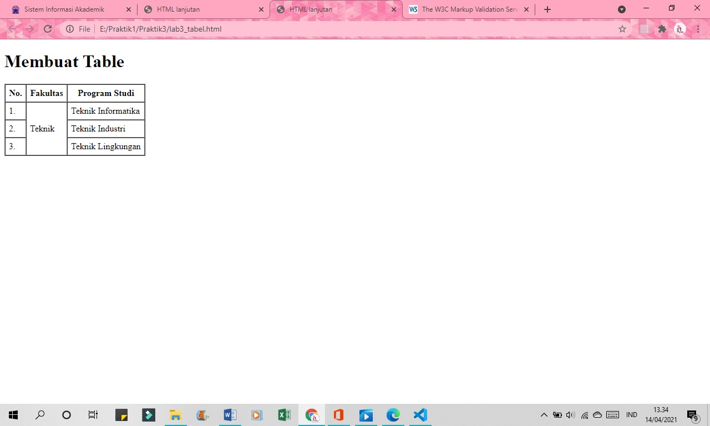

# Praktik3
## Belajar Membuat Tabel dan Form di HTML

##### Nama : Windy Septiani
##### NIM  : 311910673

### Menjawab Pertanyaan Tugas Praktik 3
#### 1. Buatlah form yang menampilkan dropdown menu dan listbox dengan multiple selection.
Code untuk membuat tampilan dropdown menu dan listbox dengan multiple selection

Tampilan di Browser

### Praktik Membuat Tabel dan Form HTML
#### File Lab3Web.html
Code untuk membuat "Ordered List"

Tampilan di Browser

Code untuk membuat "Unorderd List"

Tampilan di Browser

Code Membuat Description List

Tampilan di Browser

#### File lab3_tabel.html
Code untuk membuat "Tabel"

Tampilan di Browser

Code untuk menggabungkan "Sel Data"

Tampilan di Browser

#### File lab3_form.html
Code untuk membuat "Form"

Tampilan di Browser

Code untuk menambahkan "Style pada Form"

Tampilan di Browser

